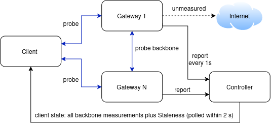

# Measurement System

Egressa measures the quality of each segment of a path with active UDP probes sent through the tunnel itself: the client measures the segment to every access gateway, and every gateway measures its backbone to the other gateways. Each segment yields RTT (p50, p95), loss rate, variance and a confidence value; the client adds the segments into a cost per path to decide whether to switch.

---

## At a glance

- **Client:** Probes all access gateways, builds paths from segments, computes cost and LCB(Δ), decides every 500 ms.
- **Gateway:** Echo - returns probes, measures backbone to other gateways.
- **Controller:**: Keeps the latest reports, adds Staleness on relay, computes nothing on them.

---

## What is measured

The unit of measurement is a **segment**: one stretch of tunnel between two nodes. A path has at most three segments, and the system measures the first two.

| Segment | Measured by | Measured? |
| --- | --- | --- |
| Client -> access gateway | The client, to **every** access gateway (the one in use and the standbys) | Yes |
| Access -> egress gateway (backbone) | Each gateway, to every other gateway it has completed a handshake with | Yes |
| Egress -> Internet | Nobody | No |

The third segment is left out on purpose: the system only compares paths that share the same egress, so this segment is identical on both sides and cancels out of the difference.

Each segment is summarized by one `SegmentStats` record with seven quantities.

| Quantity | Field | Unit | Meaning |
| --- | --- | --- | --- |
| Median RTT | `P50Micros` | µs | Typical round-trip time of a probe |
| 95th-percentile RTT | `P95Micros` | µs | Tail latency; p95 − p50 stands in for jitter |
| Loss rate | `LossRate` | 0–1 | Probes with no reply within 1 second, divided by all probes |
| RTT variance | `VarianceMicros2` | µs² | How much RTT fluctuates; used for confidence intervals |
| Sample count | `N` | probes | Probes that have an outcome (reply or loss) in the window |
| Age | `Age` | duration | Time since the most recent sample |
| Confidence | `Confidence` | 0–1 | How far the numbers above can be trusted; drops with few or old samples |

Besides this record, the monitor keeps the time of the last reply from each target. The client uses it to detect a dead access gateway.

RTT is a round-trip measurement, so the forward and return delays cannot be told apart. Likewise, a probe lost in either direction counts as one loss.

---

## How it is measured

Each segment is measured with 64-byte UDP probes sent **inside the tunnel**, about 4 probes per second per target; the target gateway sends each probe straight back. This is active measurement: the system generates its own measurement traffic and does not rely on user data packets.

### Life of a probe

1. **Send.** The measuring side opens a UDP socket bound to its own overlay address (the client's virtual IP, or the gateway's NodeIP) and sends a probe to the target gateway's `NodeIP:ProbePort` (default port 51900).
2. **Through the tunnel.** Each gateway's NodeIP is only routed through the tunnel to that same gateway. The probe therefore takes the same network path, the same encryption and the same session header as real data.
3. **Reply.** Every gateway runs an echo responder on `NodeIP:ProbePort`: any datagram that starts with the right 4 magic bytes is sent back unchanged. A dedicated routing rule makes the reply go straight back to the client through that same gateway's tunnel.
4. **Match.** The measuring side records the send time by probe ID. When the reply arrives, RTT = receive time − send time.
5. **Loss.** A probe with no reply after 1 second is recorded as a loss. A reply that arrives later is ignored, because that probe has already been counted as lost.

### Probe packet format (64 bytes)

| Bytes | Content |
| --- | --- |
| 0–3 | Magic string `EGPR`, so stray datagrams are never mistaken for replies |
| 4–7 | Target index (uint32, big-endian): one socket measures many targets |
| 8–11 | Probe ID (uint32, big-endian), increasing per target |
| 12–63 | Zero padding |

### Send rate and budget

- **Rate:** the first 20 probes to a target are 200 ms apart to get numbers quickly, then 250 ms apart. A check loop runs every 50 ms to send probes that are due and to mark probes that have timed out.
- **Cost:** 64 bytes × 4 probes/second = 256 bytes/second per target (not counting UDP/IP headers and tunnel overhead).
- **Budget:** all targets of one process share a single 64 KiB/second token bucket. When the budget runs out the probe is skipped, and a skipped probe is **not** counted as lost. The default budget is enough for 256 targets.

### Two places run the monitor

- **The client** measures every access gateway at the same time, including those not in use. The quality of a standby path is therefore known before a switch is needed.
- **Each gateway** measures its backbone to every other gateway, but only after that backbone tunnel has completed its handshake. Measuring earlier would count the probes sent while the two sides are still learning each other's ports as lost, and the link would look broken for a whole measurement window.

---

## From raw samples to statistics

Each target has an accumulator (`SegmentTracker`) that is updated per sample and keeps no raw samples; a double window limits its history to the most recent 5–10 seconds.

### Four computations

- **p50 and p95 quantiles:** the P² algorithm (Jain and Chlamtac). Each quantile keeps 5 markers and nudges them with every sample, so memory stays constant however many samples arrive. With fewer than 5 samples, the value is read directly from the samples seen so far.
- **RTT variance:** an exponentially weighted moving average (EWMA) with α = 1/8, updated together with the mean.
- **Loss rate:** losses divided by all probes that have an outcome. Lost probes do not contribute to the RTT statistics.
- **Confidence:** the product of two components, one from the sample count and one from freshness.

Update of the mean μ and variance σ² for a new RTT sample x:

$$
d = x - \mu, \qquad \mu \leftarrow \mu + \alpha d, \qquad \sigma^2 \leftarrow (1-\alpha)\left(\sigma^2 + \alpha d^2\right), \qquad \alpha = \tfrac{1}{8}
$$

Confidence, where N is the sample count and Age is the age of the most recent sample:

$$
\mathrm{Confidence} = \frac{N}{N + 20} \times 2^{-\mathrm{Age} / 30\,\mathrm{s}}
$$

So 20 samples give a confidence of 0.5, and every 30 seconds without a new sample halves it.

### The double window

P² never forgets: after an hour of 5 ms samples, a path that turns to 200 ms takes most of another hour to move its median. A monitor has to follow the path as it is **now**, so `pathmon.Window` works like this:

1. Keep two accumulators, “old” and “young”; both receive every sample.
2. Every 5 seconds (half of the 10-second window), drop the old one, promote the young one to old, and start a fresh, empty young one.
3. Always read statistics from the old one, which therefore always covers the most recent 5 to 10 seconds.

Three consequences to keep in mind when reading the numbers:

- At 4 probes/second, each record is based on roughly 20–40 samples.
- With that many samples, steady-state confidence moves between 0.50 and 0.67 and never goes higher.
- After a path changes its behaviour, at most 10 seconds later the statistics contain only samples from the new state.

## Where the numbers go

Backbone measurements travel from the gateways up to the controller every second and then down to the client; client -> access measurements stay on the client. The client is the only place that assembles segments into paths, and the controller only relays the numbers without computing anything on them.

1. **Gateways report.** Every second a gateway sends a `LinkReport` to `POST /v1/gateways/{id}/links`, holding one `SegmentStats` per backbone. The report doubles as a heartbeat: after 10 seconds without one, the controller marks the gateway as not alive.
2. **The controller stores.** It keeps the latest report of each gateway, with the time it was received, in memory.
3. **The client fetches.** The client keeps asking `GET /v1/sessions/{id}/state` (each request waits up to 2 seconds). The answer holds the gateway list, the policy, and every link with its `Staleness`: the time since the controller received that report.
4. **The client discounts old data.** `Staleness` is added to `Age`, and `Confidence` is multiplied by 2^(−Staleness / 30 s). A link whose `Staleness` exceeds 10 seconds, or that was never reported, makes every path through it unusable.
5. **The client assembles paths.** For each (access, egress) pair, the path is the ordered list of segments: the client -> access segment the client measured itself, then the access -> egress segment measured by the access gateway, if the two gateways differ.

Example with two gateways `hk` and `sg`, for a session that exits to the Internet at `hk`:

| Path | Segments added up |
| --- | --- |
| access `hk`, egress `hk` | client -> hk |
| access `sg`, egress `hk` | client -> sg, then sg -> hk |

A path is only considered when it is **reachable**: its client -> access segment has at least one sample and a reply within the last 3 seconds, and every backbone segment on it has fresh data.

Backbone numbers reach the client about 1–3 seconds after the gateway measured them: up to 1 second waiting for the next report and up to 2 seconds waiting for the next request. `Staleness` only reflects the delay at the controller; it does not count the time the client holds the numbers between two requests.

## How the measurements are used

Every 500 ms the client turns each path's measurements into one **cost** number (in µs), and it only switches paths when the lower bound of the improvement stays above a threshold for a continuous period of time.

| Measured quantity | Where it is used |
| --- | --- |
| `P50Micros`, `P95Micros` | The latency part of the cost |
| `LossRate` | The loss penalty in the cost; rules a path out entirely when a segment loses 20% or more |
| `VarianceMicros2`, `N` | The width of the cost's confidence interval |
| `Confidence` | Widens the confidence interval; a segment with no samples gives an unbounded interval, so it can never justify a switch |
| `Age` | Computing `Confidence` |
| Time of the last reply | Detecting a dead path after 3 seconds of silence |

### Cost of a segment and of a path

$$
\mathrm{Cost}_{\mathrm{seg}} = P_{50} + w_{\mathrm{tail}} \cdot \max(P_{95} - P_{50},\, 0) \; - \; W_{\mathrm{loss}} \cdot \ln(1 - \mathrm{loss})
$$

The cost of a path is the sum of its segment costs. With the default parameters (w_tail = 1, W_loss = 995,033 µs):

- the latency part is exactly p95;
- 1% loss is worth 10 ms of latency, 5% is worth 51 ms, and 10% is worth 105 ms.

### The measurement condition

The client only compares the current path with paths that have **the same egress and a different access**. With Δ = Cost(current) − Cost(candidate), a candidate qualifies when:

$$
\mathrm{LCB}(\Delta) = \mathrm{Lower}(\mathrm{current}) - \mathrm{Upper}(\mathrm{candidate}) \; > \; \mathrm{MigrationCost} + \mathrm{SafetyMargin}
$$

The lower and upper bounds of each segment come from its own measurements, with z = 1.645:

$$
\mathrm{spread}_{\mathrm{RTT}} = z \cdot (1 + w_{\mathrm{tail}}) \cdot \sqrt{\frac{\sigma^2}{N \cdot \mathrm{Confidence}}}, \qquad \mathrm{loss}_{\pm} = \mathrm{loss} \pm z \cdot \sqrt{\frac{\mathrm{loss}\,(1 - \mathrm{loss})}{N \cdot \mathrm{Confidence}}}
$$

The two loss bounds go through the same penalty function as in the cost. The spreads of the segments in a path are combined as the root of the sum of squares. If several candidates qualify, the client picks the one with the largest LCB(Δ).

A worked example, one segment per path, N = 30, Confidence = 0.6:

| Path | Measurements | Cost (ms) | Confidence interval (ms) |
| --- | --- | --- | --- |
| Current | p50 180 ms, p95 200 ms, standard deviation 10 ms, 0% loss | 200.0 | 192.2 – 207.8 |
| Candidate A | p50 30 ms, p95 36 ms, standard deviation 3 ms, 0% loss | 36.0 | 33.7 – 38.3 |
| Candidate B | same as A but with 2% loss | 56.1 | 33.7 – 115.1 |

LCB(Δ) for A is 192.2 − 38.3 = 153.9 ms; for B it is 192.2 − 115.1 = 77.1 ms. With 30 samples, 2% loss is a very uncertain estimate, so B's upper bound is pushed far out.

### The time condition

Meeting the measurement condition in a single evaluation is not enough. The anti-flapping guard (`FlapGuard`) also requires three things, shown with their default values:

- the same candidate qualifies **continuously** for 5 seconds (one failed evaluation restarts the count);
- the current path has been in use for at least 30 seconds;
- the previous switch was at least 10 seconds ago.

The one exception is a **dead path**: the current access gateway has answered no probe for 3 seconds. The client then switches at once to the cheapest reachable path to the same egress, skipping all three time conditions. It changes egress only when no path to the current egress is left, because changing egress breaks open TCP connections.

## Default parameters

Only the policy group can be changed at run time, through a JSON file passed to the controller with `--policy`; the controller hands the policy to every client. The other parameters are constants or in-code configuration with no command-line flag yet (except the probe port).

| Group | Parameter | Default | Meaning |
| --- | --- | --- | --- |
| Probe | Size | 64 bytes | UDP payload of one probe |
| Probe | Fast rate | 200 ms, first 20 probes | Gets numbers quickly for a new target |
| Probe | Steady rate | 250 ms | After the fast phase |
| Probe | Timeout | 1 s | Past this, the probe counts as lost |
| Probe | Budget | 64 KiB/s, burst up to 64 KiB | Shared by all targets of one process |
| Probe | Port | 51900 | The controller's `--probe-port` |
| Statistics | Window | 10 s | Numbers cover the most recent 5–10 s |
| Statistics | EWMA factor | 1/8 | For the RTT variance |
| Statistics | `SampleHalfCount` | 20 samples | Sample count at which confidence reaches 0.5 |
| Statistics | `StalenessHalfLife` | 30 s | Age that halves confidence |
| Data flow | Gateway report interval | 1 s | Also the heartbeat |
| Data flow | Gateway considered not alive | 10 s without a report | A not-alive egress is dropped from all paths, except the current egress |
| Data flow | Client wait per request | 2 s | Long-poll of the state |
| Data flow | Link too old | `Staleness` > 10 s | Paths through that link are dropped |
| Decision | Evaluation interval | 500 ms | Every path is re-examined each time |
| Decision | Dead path | 3 s without a reply | Switch at once |
| Policy | `TailWeight` | 1 | Weight of p95 − p50 |
| Policy | `LossWeight` | 995,033 µs | 1% loss ≈ 10 ms |
| Policy | `LossGate` | 0.20 | A segment losing 20% or more rules the path out |
| Policy | `Z` | 1.645 | Multiplier of the confidence interval |
| Policy | `MigrationCost` + `SafetyMargin` | 0 + 0 µs | The threshold LCB(Δ) must exceed |
| Policy | `ConfirmationWindow` | 5 s | The candidate must qualify continuously |
| Policy | `MinResidence` | 30 s | Minimum time to stay on a path |
| Policy | `Cooldown` | 10 s | Minimum gap between two switches |

The default threshold is 0, which means a path that is better by any amount, as long as that is statistically certain enough, meets the measurement condition. The repository's end-to-end test sets `MigrationCost` = `SafetyMargin` = 5,000 µs, a threshold of 10 ms.
